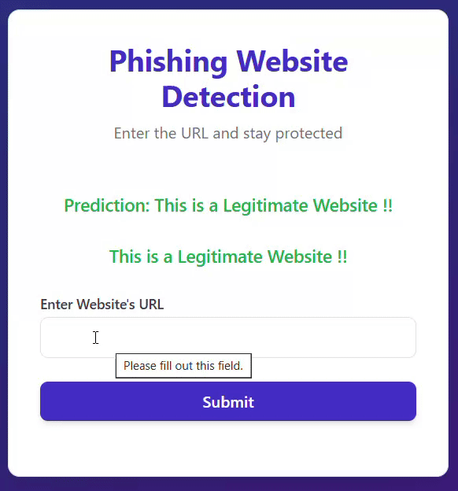

# Phishing URL Detection

A machine learning-powered web application that detects whether a given URL is a **phishing** (malicious) or **legitimate** website. Built with Python and Flask, it uses Natural Language Processing (NLP) techniques combined with trained ML models to analyze URLs in real time.

---

## Demo



---

## What is Phishing?

Phishing is a type of cyber attack where attackers create fake websites that look like real ones to steal sensitive information like passwords, credit card numbers, or personal data. These fake websites are usually shared through suspicious URLs.

This project aims to automatically detect such URLs using machine learning — without needing to visit the website.

---

## What This Project Does

- Takes a URL as input from the user via a web form
- Cleans and preprocesses the URL (removes `https://`, `www.`, etc.)
- Converts the URL into numerical features using a **CountVectorizer** (NLP)
- Passes those features into a trained **Machine Learning model**
- Predicts whether the URL is **Phishing** or **Legitimate**
- Displays the result with color-coded feedback (red for phishing, green for legitimate)

---

## How It Works (Step by Step)

1. **User Input** — The user enters a URL into the web form
2. **URL Cleaning** — The app strips `http://`, `https://`, and `www.` from the URL using regex
3. **Vectorization** — The cleaned URL is transformed into a numeric feature vector using a pre-trained `CountVectorizer` (`vectorizer.pkl`)
4. **Prediction** — The feature vector is passed to the trained ML model (`model.pkl`) which outputs `good` or `bad`
5. **Result Display** — The app renders the result on the webpage:
   - 🔴 `This is a Phishing Website !!` — if the URL is malicious
   - 🟢 `This is a Legitimate Website !!` — if the URL is safe

---

## Machine Learning Details

### Dataset
- Source: [Phishing Site URLs — Kaggle](https://www.kaggle.com/datasets/taruntiwarihp/phishing-site-urls)
- Contains hundreds of thousands of labeled URLs marked as `good` or `bad`

### Preprocessing
- URLs were cleaned by removing protocols and subdomains
- Text vectorization was done using **CountVectorizer** (Bag of Words approach)
- This converts each URL into a sparse matrix of token counts

### Models Trained & Evaluated
| Model | Description |
|---|---|
| Logistic Regression | Linear classifier, fast and interpretable |
| Naive Bayes (Multinomial) | Probabilistic model, great for text data |
| Random Forest | Ensemble of decision trees, high accuracy |
| Support Vector Machine (SVM) | Finds optimal decision boundary |

### Final Model
The best performing model was saved as `model.pkl` and is used in the Flask app for real-time predictions. `mnb.pkl` contains the saved Multinomial Naive Bayes model for reference.

---

## Tech Stack

| Layer | Technology |
|---|---|
| Language | Python 3.x |
| Web Framework | Flask |
| ML Library | scikit-learn |
| NLP | NLTK, CountVectorizer |
| Data Processing | Pandas, NumPy |
| Visualization | Matplotlib, Seaborn, WordCloud |
| Frontend | HTML, CSS (Jinja2 templates) |

---

## Project Structure

```
Phishing-URL-Detection/
├── app.py                  # Flask web application
├── templates/
│   └── index.html          # Frontend UI
├── model.pkl               # Trained ML model (best performing)
├── mnb.pkl                 # Saved Naive Bayes model
├── vectorizer.pkl          # Trained CountVectorizer
├── phishing website detection.ipynb  # Jupyter notebook (training & analysis)
├── requirements.txt        # Python dependencies
├── demo.gif                # Project demo
└── README.md
```

---

## Installation & Setup

1. Clone the repository:
   ```bash
   git clone https://github.com/alpha-coder21/Phishing-URL-Detection.git
   cd Phishing-URL-Detection
   ```

2. Create and activate a virtual environment:
   ```bash
   python -m venv env
   env\Scripts\activate
   ```

3. Install dependencies:
   ```bash
   pip install -r requirements.txt
   ```

4. Run the app:
   ```bash
   python app.py
   ```

5. Open your browser and go to:
   ```
   http://127.0.0.1:5000
   ```

---

## Usage Example

| Input URL | Output |
|---|---|
| `yeniik.com.tr/wp-admin/js/login.alibaba.com/login.jsp.php` | 🔴 This is a Phishing Website !! |
| `www.youtube.com/` | 🟢 This is a Legitimate Website !! |
| `https://www.google.com` | 🟢 This is a Legitimate Website !! |

---

## Dependencies

```
flask==3.0.3
scikit-learn==1.4.2
pandas==2.2.2
numpy==1.26.4
seaborn==0.13.2
matplotlib==3.8.4
nltk==3.8.1
wordcloud==1.9.3
```

---

## License

This project is built for educational purposes only. Not intended for production use.
